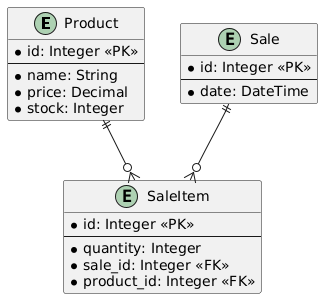

# Point of Sale (POS) System API

## Introduction
This API provides endpoints for managing a Point of Sale system, including products, sales, and sale items. It allows you to:

- Manage product inventory (create, read, update, delete products)
- Process sales transactions
- Track stock levels automatically
- Calculate totals and subtotals
- View sales history

The API is built using Django REST Framework and follows RESTful principles. It includes automatic stock validation and updates, computed fields for pricing, and proper error handling.

## Key Features:
- Full CRUD operations for products and sales
- Automatic stock management
- Price calculations
- Input validation
- Detailed error responses


## Base URL
```
http://localhost:8000/api/
```

## Data structure   

Here is the Entity Relationship diagram of our database structure:



The diagram shows the relationships between:
- Products (containing inventory information)
- Sales (representing transactions)
- SaleItems (linking products to sales)


## Endpoints

### Product Endpoints
| Method | Endpoint | Description |
|--------|----------|-------------|
| GET | `/api/products/` | List all products |
| GET | `/api/products/{id}/` | Get a specific product |
| POST | `/api/products/` | Create a new product |
| PUT | `/api/products/{id}/` | Update a product |
| PATCH | `/api/products/{id}/` | Partially update a product |
| DELETE | `/api/products/{id}/` | Delete a product |

### Sale Endpoints
| Method | Endpoint | Description |
|--------|----------|-------------|
| GET | `/api/sales/` | List all sales |
| GET | `/api/sales/{id}/` | Get a specific sale |
| POST | `/api/sales/` | Create a new sale |
| PUT | `/api/sales/{id}/` | Update a sale |
| PATCH | `/api/sales/{id}/` | Partially update a sale |
| DELETE | `/api/sales/{id}/` | Delete a sale |

### Sale Item Endpoints
| Method | Endpoint | Description |
|--------|----------|-------------|
| GET | `/api/saleitems/` | List all sale items |
| GET | `/api/saleitems/{id}/` | Get a specific sale item |
| POST | `/api/saleitems/` | Create a new sale item |
| PUT | `/api/saleitems/{id}/` | Update a sale item |
| PATCH | `/api/saleitems/{id}/` | Partially update a sale item |
| DELETE | `/api/saleitems/{id}/` | Delete a sale item |

### Endpoints details

#### Products

##### List all products
```http
GET /api/products/
```

*Response* 
```json
[
    {
        "id": 1,
        "name": "Product Name",
        "price": "99.99",
        "stock": 100
    }
]
```

##### Get single product
```http
GET /api/products/{id}/
```

*Response*
```json
{
    "id": 1,
    "name": "Product Name",
    "price": "99.99",
    "stock": 100
}
```

##### Create product
```http
POST /api/products/
```

*Request Body*
```json
{
    "name": "New Product",
    "price": "99.99",
    "stock": 100
}
```

##### Update product
```http
PUT /api/products/{id}/
PATCH /api/products/{id}/  # For partial updates
```

*Request Body*
```json
{
    "name": "Updated Product",
    "price": "149.99",
    "stock": 200
}
```

##### Delete product
```http
DELETE /api/products/{id}/
```

#### Sales

##### List all sales
```http
GET /api/sales/
```

*Response*
```json
[
    {
    "id": 1,
    "date": "2025-02-21T17:01:51.407903Z",
    "items_data": [
      {
        "product": {
          "id": 1,
          "name": "Product 1",
          "price": "100.00",
          "stock": 10
        },
        "quantity": 4,
        "subtotal": 400.0
      }
    ],
    "total_price": 400.0
    }
]
```

##### Get single sale
```http
GET /api/sales/{id}/
```

##### Create sale
```http
POST /api/sales/
```

*Request Body*
```json
{
    "items_data": [
        {
            "product": 1,
            "quantity": 3
        },
        {
            "product": 2,
            "quantity": 2
        }
    ]
}
```

##### Update sale
```http
PUT /api/sales/{id}/
PATCH /api/sales/{id}/  # For partial updates
```

##### Delete sale
```http
DELETE /api/sales/{id}/
```

#### Sale Items

##### List all sale items
```http
GET /api/saleitems/
```

*Response*
```json
[
    {
        "id": 1,
        "sale": 1,
        "product": 1,
        "quantity": 3,
        "subtotal": "299.97"
    }
]
```

##### Get single sale item
```http
GET /api/saleitems/{id}/
```

##### Create sale item
```http
POST /api/saleitems/
```

*Request Body*
```json
{
    "sale": 1,
    "product": 1,
    "quantity": 3
}
```

##### Update sale item
```http
PUT /api/saleitems/{id}/
PATCH /api/saleitems/{id}/  # For partial updates
```

##### Delete sale item
```http
DELETE /api/saleitems/{id}/
```

## Computed Fields

- `total_price`: Automatically calculated for sales as the sum of all sale items (quantity * product price)
- `subtotal`: Automatically calculated for sale items as (quantity * product price)

## Error Responses

The API will return appropriate HTTP status codes:

- `200 OK`: Request successful
- `201 Created`: Resource created successfully
- `400 Bad Request`: Invalid request body
- `404 Not Found`: Resource not found
- `500 Internal Server Error`: Server error

Error responses will include a message describing the error:

```json
{
    "error": "Error message description"
}
```

## Testing

To run all tests, use the following command:
```
python manage.py test
```

### Unit Tests 

#### Models

To run **product model** tests, use the following command:
```
python manage.py test api.tests.models.test_product
```

### Integration Tests

To run **product integration** tests, use the following command:
```
python manage.py test api.tests.integration.test_product
```

### For Colaboration

For robustness, please include test for all one feature that you have implemented, following the file structure used in the project.


